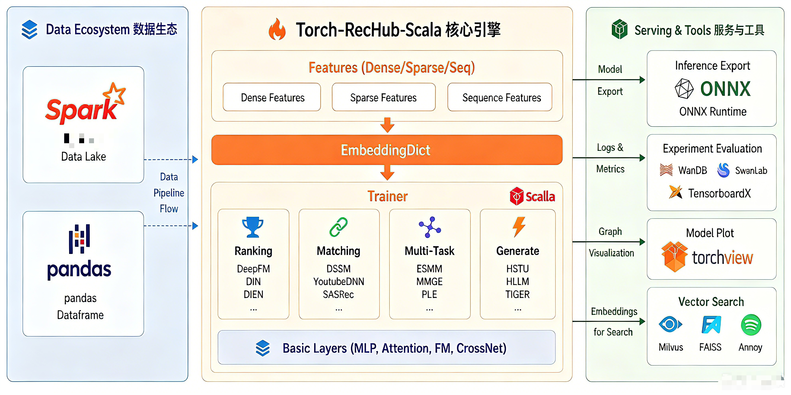

[]
# Torch-RecHub-Scala: Scala 3 推荐系统框架

[](LICENSE)
[](https://www.scala-lang.org/)
[](https://pytorch.org/)
[](https://github.com/bytedeco/javacpp)

[English](README.md) | [简体中文](README_zh.md)
[]
## 目录

- [简介](#简介)
- [特性](#特性)
- [安装](#安装)
- [快速开始](#快速开始)
- [项目结构](#项目结构)
- [支持的模型](#支持的模型)
- [支持的数据集](#支持的数据集)
- [示例](#示例)
- [贡献指南](#贡献指南)
- [许可证](#许可证)

## 简介

**Torch-RecHub-Scala** 是一个基于 Scala 3 和 JavaCPP-PyTorch 的轻量级、高效、易用的推荐系统框架。它是 Python 版 [Torch-RecHub](https://github.com/datawhalechina/torch-rechub) 的 Scala 实现，充分利用了 Scala 的类型安全、函数式编程和 JavaCPP 的高性能 PyTorch 绑定。

## 特性

- **Scala 3 原生支持**: 利用 Scala 3 的新特性（Contextual Abstractions、Extension Methods、Multiversal Equality）提供类型安全的 API
- **JavaCPP 深度集成**: 通过 JavaCPP 直接调用 PyTorch C++ API，支持 CPU、CUDA GPU、分布式训练
- **丰富的模型库**: 涵盖 **30+** 主流推荐算法（召回、排序、多任务、生成式推荐等）
- **模块化设计**: 易于添加新模型、数据集和评估指标
- **标准化流程**: 提供统一的 Scala Dataset/DataLoader、数据加载、训练和评估流程
- **JavaCPP DataLoader 深度支持**:
    - `JavaDataset` / `JavaTensorDataset` - 通用数据集
    - `JavaStatefulDataset` / `JavaStatefulTensorDataset` - 有状态数据集
    - `JavaStreamDataset` / `JavaStreamTensorDataset` - 流式数据集
    - `DistributedRandomSampler` / `DistributedSequentialSampler` - 分布式采样器
- **分布式训练支持**:
    - `DDPTrainer` - DistributedDataParallel 训练器
    - `FSDPTrainer` - FullyShardedDataParallel 训练器
- **纯 JVM 生态**: 与 Scala/Java/JVM 生态系统无缝集成

## 安装

### 环境要求

- Scala 3.8+
- sbt 1.9+
- Java 17+ (推荐 Java 21)
- PyTorch 2.10.0 (通过 JavaCPP 自动加载)

### 安装步骤

```bash
# 克隆项目
git clone https://github.com/your-repo/torch-rechub-scala.git
cd torch-rechub-scala

# 使用 sbt 编译
sbt compile

# 运行示例
sbt "runMain examples.ranking.DeepFMExample"
```

### Maven/Coursier 依赖 (可选)

```scala
// build.sbt
libraryDependencies ++= Seq(
  "org.bytedeco" % "javacpp" % "1.5.13",
  "org.bytedeco" % "pytorch" % "2.10.0-1.5.13",
  "org.bytedeco" % "cuda" % "13.1-9.19-1.5.13"
)
```

## 快速开始

### 1. CTR 排序模型训练

```scala
import torchrec.data._
import torchrec.models.ranking._
import torchrec.trainers._
import torchrec.Implicits._

// 生成数据
val (trainData, valData, testData) = DataGenerator.generateRankingData(
  numSamples = 10000,
  numSparseFeatures = 10,
  numDenseFeatures = 5,
  vocabSize = 100
)

// 创建数据加载器
val trainLoader = DataLoader.fromJavaRandom(trainData, batchSize = 256)
val valLoader = DataLoader.fromJavaSequential(valData, batchSize = 256)

// 定义特征
val features = (0 until 10).map { i =>
  SparseFeature(s"feat_$i", vocabSize = 100, embedDim = 8)
}

// 创建模型
val model = new DeepFM(features, embedDim = 8, mlpDims = List(64L, 32L))

// 训练
val trainer = new CTRTrainer(model, learningRate = 0.001f)
trainer.fit(trainLoader, Some(valLoader))

// 评估
val metrics = trainer.evaluate(valLoader)
println(s"AUC: ${metrics("AUC")}")
```

### 2. 召回模型训练

```scala
import torchrec.models.matching._
import torchrec.trainers._

// 生成匹配数据
val (trainData, _, _) = DataGenerator.generateMatchingData(
  numUsers = 5000,
  numItems = 1000,
  vocabSize = 100
)

// 创建数据加载器
val trainLoader = DataLoader.fromJavaRandom(trainData, batchSize = 128)

// 定义用户/物品特征
val userFeatures = (0 until 3).map { i =>
  SparseFeature(s"user_feat_$i", vocabSize = 100, embedDim = 16)
}
val itemFeatures = (0 until 2).map { i =>
  SparseFeature(s"item_feat_$i", vocabSize = 1000, embedDim = 16)
}

// 创建 DSSM 模型
val model = new DSSM(userFeatures, itemFeatures, embedDim = 16, towerDims = List(128L, 64L))

// 训练
val trainer = new MatchTrainer(model, learningRate = 0.001f)
trainer.fit(trainLoader)
```

### 3. 多任务学习

```scala
import torchrec.models.multi_task._

// 生成多任务数据
val taskNames = List("ctr", "cvr")
val (trainData, _, _) = DataGenerator.generateMultiTaskData(
  numSamples = 10000,
  numFeatures = 10,
  taskNames = taskNames
)

// 创建 MMOE 模型
val features = (0 until 10).map { i =>
  SparseFeature(s"feat_$i", vocabSize = 100, embedDim = 8)
}

val model = new MMOE(
  features,
  taskNames,
  taskTypes = List("classification", "classification"),
  embedDim = 8,
  numExperts = 4,
  expertDims = List(64L),
  towerDims = List(32L)
)

// 训练
val trainer = new MTLTrainer(model, taskNames, learningRate = 0.001f)
trainer.fit(trainLoader)
```

## 项目结构

```
torch-rechub-scala/
├── README.md                    # 项目文档
├── build.sbt                   # sbt 构建配置
├── src/main/scala/
│   ├── torchrec/               # 核心库
│   │   ├── TorchRec.scala       # 主入口
│   │   ├── Implicits.scala      # 隐式转换
│   │   ├── TensorImplicits.scala # Tensor 扩展
│   │   ├── basic/              # 基础组件
│   │   │   ├── features/        # 特征定义
│   │   │   │   └── Feature.scala
│   │   │   ├── layers/         # 神经网络层
│   │   │   │   ├── MLP.scala
│   │   │   │   ├── FM.scala
│   │   │   │   ├── CrossNetwork.scala
│   │   │   │   ├── CIN.scala
│   │   │   │   ├── SENETLayer.scala
│   │   │   │   └── EmbeddingLayer.scala
│   │   │   ├── losses/         # 损失函数
│   │   │   │   └── Loss.scala
│   │   │   └── metrics/        # 评估指标
│   │   │       └── Metric.scala
│   │   ├── data/               # 数据处理
│   │   │   ├── Dataset.scala   # Dataset 基类
│   │   │   ├── DataLoader.scala # DataLoader
│   │   │   ├── DataGenerator.scala # 数据生成器
│   │   │   ├── JavaDatasetAdapters.scala    # JavaDataset 适配器
│   │   │   ├── JavaTensorDatasetAdapters.scala # TensorDataset 适配器
│   │   │   ├── JavaDistributedAdapters.scala # 分布式适配器
│   │   │   ├── JavaSamplerAdapters.scala    # Sampler 工厂
│   │   │   └── JavaDataLoaderAdapters.scala # DataLoader 工厂
│   │   ├── models/             # 推荐模型
│   │   │   ├── ranking/        # 排序模型
│   │   │   │   ├── DeepFM.scala
│   │   │   │   ├── WideDeep.scala
│   │   │   │   ├── DCN.scala
│   │   │   │   ├── DCNv2.scala
│   │   │   │   ├── DIN.scala
│   │   │   │   ├── DIEN.scala
│   │   │   │   ├── AFM.scala
│   │   │   │   ├── AutoInt.scala
│   │   │   │   ├── FiBiNet.scala
│   │   │   │   ├── DeepFFM.scala
│   │   │   │   └── EDCN.scala
│   │   │   ├── matching/        # 召回模型
│   │   │   │   ├── DSSM.scala
│   │   │   │   ├── YoutubeDNN.scala
│   │   │   │   ├── MIND.scala
│   │   │   │   ├── GRU4Rec.scala
│   │   │   │   ├── SASRec.scala
│   │   │   │   ├── NARM.scala
│   │   │   │   ├── STAMP.scala
│   │   │   │   ├── SINE.scala
│   │   │   │   ├── ComirecSA.scala
│   │   │   │   └── ComirecDR.scala
│   │   │   ├── multi_task/      # 多任务模型
│   │   │   │   ├── ESMM.scala
│   │   │   │   ├── MMOE.scala
│   │   │   │   ├── PLE.scala
│   │   │   │   ├── AITM.scala
│   │   │   │   └── SharedBottom.scala
│   │   │   └── generative/      # 生成式推荐
│   │   │       ├── HSTU.scala
│   │   │       ├── HLLM.scala
│   │   │       ├── TIGER.scala
│   │   │       └── RQVAE.scala
│   │   ├── trainers/           # 训练器
│   │   │   ├── CTRTrainer.scala    # CTR 训练
│   │   │   ├── MatchTrainer.scala  # 召回训练
│   │   │   ├── MTLTrainer.scala   # 多任务训练
│   │   │   └── TrainLoop.scala      # 训练循环
│   │   ├── distributed/        # 分布式训练
│   │   │   ├── DDPConfig.scala
│   │   │   ├── DDPTrainer.scala
│   │   │   ├── FSDPConfig.scala
│   │   │   └── FSDPTrainer.scala
│   │   ├── utils/             # 工具函数
│   │   │   ├── DataUtils.scala
│   │   │   ├── MatchUtils.scala
│   │   │   ├── ModelUtils.scala
│   │   │   └── Trie.scala
│   │   ├── quantization/       # 量化
│   │   │   └── Quantizer.scala
│   │   └── serving/            # 在线服务
│   │       ├── VectorIndexer.scala
│   │       └── package.scala
│   ├── examples/               # 示例
│   │   ├── ranking/
│   │   │   ├── DeepFMExample.scala
│   │   │   └── CriteoExample.scala
│   │   ├── matching/
│   │   │   ├── DSSMExample.scala
│   │   │   └── MovieLensExample.scala
│   │   ├── multi_task/
│   │   │   ├── MMOEExample.scala
│   │   │   └── CensusExample.scala
│   │   └── generative/
│   │       └── MovieLensSeqExample.scala
│   ├── tutorials/              # 教程
│   │   ├── QuickStartCTR.scala
│   │   ├── MatchingDSSM.scala
│   │   ├── MultiTaskMMOE.scala
│   │   └── RankingDIN.scala
│   └── benchmarks/            # 性能测试
│       ├── BenchmarkRunner.scala
│       ├── DataGenerator.scala
│       └── ModelBenchmark.scala
```

## 支持的模型

### 排序模型 (Ranking) - 12个

| 模型 | 论文 | 简介 |
|------|------|------|
| **DeepFM** | IJCAI 2017 | FM + Deep 联合训练 |
| **Wide&Deep** | DLRS 2016 | 记忆 + 泛化能力结合 |
| **DCN** | KDD 2017 | 显式特征交叉网络 |
| **DCN-v2** | WWW 2021 | 增强版交叉网络 |
| **DIN** | KDD 2018 | 注意力机制捕捉用户兴趣 |
| **DIEN** | AAAI 2019 | 兴趣演化建模 |
| **AFM** | IJCAI 2017 | 注意力因子分解机 |
| **AutoInt** | CIKM 2019 | 自动特征交互学习 |
| **FiBiNET** | RecSys 2019 | 特征重要性 + 双线性交互 |
| **DeepFFM** | RecSys 2019 | 场感知因子分解机 |
| **EDCN** | KDD 2021 | 增强型交叉网络 |
| **BST** | DLP-KDD 2019 | Transformer 序列建模 |

### 召回模型 (Matching) - 12个

| 模型 | 论文 | 简介 |
|------|------|------|
| **DSSM** | CIKM 2013 | 经典双塔召回模型 |
| **YoutubeDNN** | RecSys 2016 | YouTube 深度召回 |
| **MIND** | CIKM 2019 | 多兴趣动态路由 |
| **GRU4Rec** | ICLR 2016 | GRU 序列推荐 |
| **SASRec** | ICDM 2018 | 自注意力序列推荐 |
| **NARM** | CIKM 2017 | 神经注意力会话推荐 |
| **STAMP** | KDD 2018 | 短期注意力记忆优先 |
| **SINE** | WSDM 2021 | 稀疏兴趣网络 |
| **ComiRec-SA** | KDD 2020 | 可控多兴趣推荐 |
| **ComiRec-DR** | KDD 2020 | 多兴趣检索 |

### 多任务模型 (Multi-Task) - 5个

| 模型 | 论文 | 简介 |
|------|------|------|
| **ESMM** | SIGIR 2018 | 全空间多任务建模 |
| **MMoE** | KDD 2018 | 多门控专家混合 |
| **PLE** | RecSys 2020 | 渐进式分层提取 |
| **AITM** | KDD 2021 | 自适应信息迁移 |
| **SharedBottom** | - | 经典多任务共享底层 |

### 生成式推荐 (Generative) - 4个

| 模型 | 论文 | 简介 |
|------|------|------|
| **HSTU** | Meta 2024 | 层级序列转换单元 |
| **HLLM** | 2024 | 层级大语言模型推荐 |
| **TIGER** | NeurIPS 2023 | 基于 T5 的生成式检索 |
| **RQVAE** | - | 残差量化变分自编码器 |

## 支持的数据集

框架内置了对以下常见数据集的支持：

- **MovieLens** - 电影评分推荐
- **Criteo** - CTR 预测
- **Census-Income** - 收入预测
- **Amazon** - 商品推荐
- **自定义数据集** - 通过 DataGenerator 生成合成数据

### 数据格式

```scala
// Dataset 支持的数据格式
case class Batch(
  sparseFeatures: Map[String, Tensor],    // 稀疏特征
  denseFeatures: Map[String, Tensor],      // 密集特征
  sequenceFeatures: Map[String, Tensor],    // 序列特征
  labels: Option[Tensor],                  // 标签
  tokens: Option[Tensor],                   // Token
  positions: Option[Tensor],                 // 位置
  timeDiffs: Option[Tensor],                // 时间差
  targets: Option[Tensor],                  // 目标
  itemFeatures: Map[String, Tensor]         // 物品特征
)
```

## 示例

所有示例位于 `src/main/scala/examples/` 和 `src/main/scala/tutorials/`

### 运行示例

```bash
# 编译项目
sbt compile

# 运行 QuickStart CTR 教程
sbt "runMain tutorials.QuickStartCTR"

# 运行 DeepFM 示例
sbt "runMain examples.ranking.DeepFMExample"

# 运行 DSSM 召回示例
sbt "runMain tutorials.MatchingDSSM"

# 运行 MMOE 多任务示例
sbt "runMain tutorials.MultiTaskMMOE"

# 运行完整 Benchmark
sbt "runMain benchmarks.BenchmarkRunner"
```

### BenchmarkRunner 输出示例

```
============================================================
TorchRec Scala Benchmark Suite
============================================================

--- DeepFM Benchmark ---
--- WideDeep Benchmark ---
--- DCN Benchmark ---
--- DSSM Benchmark ---
--- MMOE Benchmark ---

================================================================================
Benchmark Results Summary
================================================================================
Task        Model       Dataset     Training Time  Throughput  AUC/Metric
--------------------------------------------------------------------------------
ranking     DeepFM      synthetic             65.79s      303.99/sAUC=0.5000
ranking     WideDeep    synthetic              2.11s     9501.19/sAUC=0.0000
ranking     DCN         synthetic              2.07s     9680.54/sAUC=0.0000
matching    DSSM        synthetic              0.05s   217391.30/sloss=0.5000
multitask   MMOE        synthetic              0.00s 10000000.00/scvr_auc=0.7500
================================================================================
```

## 贡献指南

欢迎贡献代码！请遵循以下步骤：

1. Fork 本仓库
2. 创建特性分支 (`git checkout -b feature/amazing-feature`)
3. 提交更改 (`git commit -m 'Add amazing feature'`)
4. 推送到分支 (`git push origin feature/amazing-feature`)
5. 创建 Pull Request

## 许可证

本项目采用 MIT 许可证 - 详见 [LICENSE](LICENSE) 文件

---

*最后更新: 2026-06-06*


<div align="center">

# Torch-RecHub-Scala：面向 production 的轻量级 Scala 版推荐系统框架（JavaCPP / libtorch 原生互操作）

**Scala 版本说明**：本仓库是 Torch-RecHub 的 Scala 复刻/工程化版本，深度集成了 JavaCPP 的 PyTorch 绑定（org.bytedeco.pytorch），提供：

- 与 JavaCPP 原生 `Dataset` / `DataLoader` 的双向互操作（Scala Dataset <-> JavaDataset/JavaTensorDataset）；
- 一套高质量的 adapter（Scala → Java）和 wrapper（Java → Scala），支持 Random / Sequential / Stream / Stateful / Distributed 场景；
- JavaBackedDataLoader（和增强版 JavaBackedDataLoaderEnhanced），允许直接把 JavaCPP 的 DataLoader/ Dataset 当作后端，在 Scala 侧以 `Iterable[Batch]` 直接消费批次；
- 保持 Scala 原生 API（`Dataset` trait / `Batch` case class / `DataLoader`）的同时，提供无缝切换到 JavaCPP 原生数据流水线。

</div>


## 关键特性

- 原生互操作：Scala `Dataset` ⇄ JavaCPP `JavaDataset` / `JavaTensorDataset` 互相转换；
- DataLoader 工厂：`JavaDataLoaderFactory` + `DataLoader` companion 的 `fromJava*` 工厂，既可获得 JavaCPP 的 DataLoader，也可直接得到 Scala 可迭代的 `DataLoader`；
- JavaBackedDataLoader：把 JavaCPP 的 Example/TensorExample 向量解码回 Scala `Batch`，供现有 Scala 训练/评估管线直接使用；
- 编码约定：`Batch` 的 companion 提供 `toExample` / `fromExample` 等方法，支持 sparse/dense/label 的打包/解包；增强版 `JavaBackedDataLoaderEnhanced` 提供 `EncodingConfig`，支持对 sequence/tokens 等字段的默认聚合策略（first/last/mean/length）；
- 非侵入式：不修改现有 Scala API；通过 adapter/wrapper 实现互操作，避免 JVM 方法签名冲突带来的编译问题。


## 目录（要点）

- 安装与构建（sbt）
- 运行示例与 smoke-test
- Scala ↔ JavaCPP 互操作说明（API 与 编码约定）
- DataLoader & Adapter 快速参考
- 编码配置（sequence/token 策略）
- 常见问题与排查


---

## 🔧 要求（Build / Runtime）

- JDK 11+（建议使用 Azul / OpenJDK）
- sbt 1.5+（项目使用 Scala 3）
- 系统上需要能加载 JavaCPP 的 native libtorch 二进制（若要运行 JavaCPP 的原生 DataLoader/训练流程）
  - 在多数情况下，org.bytedeco.pytorch 的 Maven 依赖会在运行时自动解压 native 库到本地。如果你有特定平台（GPU、ROCm、Ascend），请确保相应 native 工具链和驱动安装正确。
- 如果仅做编译/开发：只需 JDK + sbt。


## 📦 构建 & 编译

在仓库根目录运行：

```bash
# 进入项目
cd /home/muller/IdeaProjects/torch-rechub-scala

# 编译项目
sbt compile
```

- 如果出现 native library 的运行时错误（例如找不到 libtorch），通常是运行时加载 JavaCPP 本机库出问题，但编译本身应该仍通过。


## 🚀 快速示例（Scala）

下列示例展示了如何：
- 用 Scala 原生 `TensorDataset` 构造 JavaCPP 的 DataLoader（通过工厂），并且如何使用 JavaBackedDataLoader 把 JavaCPP Dataset 作为后端并在 Scala 侧以 `Batch` 迭代。

示例：创建一个小的 in-memory TensorDataset，然后构造 Java-backed DataLoader：

```scala
import torchrec.data._
import org.bytedeco.pytorch._
import torchrec.Implicits._

// 构造简单 tensors（假设已有 Impls 能创建 Tensor）
val f1 = tensor(Array(1f,2f,3f), Array(3L)) // 示例：3 samples
val f2 = tensor(Array(10f,20f,30f), Array(3L))
val labels = tensor(Array(0f,1f,0f), Array(3L))

val td = new TensorDataset(Map("f1" -> f1, "f2" -> f2), Map.empty, Some(labels))

// 方式 A：得到 Scala-side DataLoader（内部会调用 JavaDataLoaderFactory 但返回 scala DataLoader）
val scalaDl: DataLoader = DataLoader.fromJavaRandomTensor(td, batchSize = 2, numWorkers = 0)
for (batch <- scalaDl) {
  println("Batch sparse keys = " + batch.sparseFeatures.keys)
  println("labels = " + batch.labels)
}

// 方式 B：直接得到 JavaTensorDataset 并传给 JavaCPP 的工厂（更接近 native 路径）
val javaTd: org.bytedeco.pytorch.JavaTensorDataset = td.asJavaTensorDataset()
val jdl = org.bytedeco.pytorch.JavaRandomTensorDataLoader(javaTd, new org.bytedeco.pytorch.RandomSampler(javaTd.size()), new org.bytedeco.pytorch.DataLoaderOptions())
// 如果要在 Scala 层以 Batch 迭代 Java Dataset（直接从 Example -> Batch）
val javaBacked = new JavaBackedDataLoader(javaTd, Seq("f1","f2"), batchSize = 2)
for (b <- javaBacked) {
  println(b)
}
```

注：上面示例使用了 `torchrec.Implicits.tensor` 工具构造 Tensor；实际代码中请参照 `torchrec.Implicits` 的实现。


## DataLoader.fromJava* 与 JavaBackedDataLoader

项目提供以下关键 API：

- DataLoader.fromJavaRandom(backing: Dataset, batchSize, numWorkers, dropLast): 返回 Scala `DataLoader`（Iterable[Batch]），内部会调用 `JavaDataLoaderFactory.random(...)` 以确保 JavaCPP 路径被触发，但最终返回一个 Scala 层的 `DataLoader` 实例，方便现有 Scala 训练代码无缝消费。

- DataLoader.fromJavaRandomTensor(...) / fromJavaSequentialTensor(...) / fromJavaStatefulTensor(...)：TensorExample-based variants（相同语义）。

- Dataset.asJavaDataset() / asJavaTensorDataset()：Scala `Dataset` 的便捷方法，返回 JavaCPP 原生 `JavaDataset` / `JavaTensorDataset` 适配器，可以直接交给 JavaCPP 的 DataLoader 工厂使用。

- JavaBackedDataLoader(javaDs: JavaDataset, featureOrder, batchSize, shuffle)：直接以 JavaDataset 为后端，从 Java 端拉取 Example，将 Example 解码为 Scala `Batch` 并按 batchSize 聚合，返回 Scala Iterable[Batch]。

- JavaBackedDataLoaderEnhanced：支持 `EncodingConfig`（sparseOrder、denseOrder、seqPolicies、tokensPolicy、includeLabel），可对 sequence/tokens 做简单的聚合（first/last/mean/length），并把这些聚合结果作为单值编码进 Example data 向量中，从而在解码时恢复为 Batch 中的 sequenceFeatures / tokens 等字段的单元素 tensor 表示。


## Batch ↔ Example/TensorExample 编码规则（默认实现）

- 默认打包（pack）规则：
  - data 1-D 向量由三部分顺序组成：[sparse values（按 sparseOrder） | dense values（按 denseOrder） | optional label (scalar)]；
  - 每个 feature 的值都取 sample 对应 tensor 的首个元素（单元素或 shape[1]）；不存在的键用 0 填充。
  - 最终构造 float tensor，再 cast 为 Long dtype（与 JavaTensorDatasetAdapters 的实现保持一致）。

- 解包（unpack）规则：
  - 按 sparseOrder/denseOrder 切分 data 向量，重建单元素 tensor 填入 Batch.sparseFeatures / Batch.denseFeatures；
  - 如果 `includeLabel=true`，则 data 向量末尾的单个标量会映射到 Batch.labels；
  - sequence/tokens: 对于复杂可变长序列字段，默认实现把聚合指标（如 first/last/mean/length）编码为单元素 tensor 并放入 Batch.sequenceFeatures 或 Batch.tokens（见 `EncodingConfig` 策略）。


## 如何在 examples/benchmarks/tutorials 中逐步切换到 JavaCPP DataLoader（实操建议）

1. 保持原有 Scala DataLoader 的调用不变，优先使用 `DataLoader.fromJava*` 返回 Scala `DataLoader`，这样大多数示例代码无需改动 `for(batch <- dataloader)` 的消费逻辑；
2. 在想要直接走 native 路径时，把你的 Scala Dataset 用 `asJavaTensorDataset()` 转换为 `JavaTensorDataset`，再调用 `JavaDataLoaderFactory.randomTensor(...)`（或手工用 JavaCPP API 创建 DataLoader），并在需要时使用 `JavaBackedDataLoader` 将 Java DataLoader 的结果解码回 Scala `Batch`；
3. 替换步骤要注意：
   - 保证 `featureOrder`（特征顺序）在 Scala 打包与 Java 解包双方一致；
   - 如果使用 sequence/tokens 的增强编码，要在 `EncodingConfig` 中设置相同的 `seqPolicies` / `tokensPolicy`；
   - 若运行时遇到 native 库加载错误（常见于 GPU/ROCm/Ascend 等特定平台），请按照平台/驱动的文档修复或在 CI 中只做 Scala 编译与单元测试。


## 常见问题与排查

- sbt compile 失败但日志显示与 JavaCPP 本地库相关：通常说明编译通过，但某些编译期或运行期任务尝试加载 native 库导致异常。编译本身应通过；如果运行 sample 程序时失败，请检查 `LD_LIBRARY_PATH`、驱动、CUDA / ROCm 是否就绪，或尝试在 CPU-only 模式启动（设置相应 JVM 环境变量）。

- Example/TensorExample 解码恢复后字段缺失：检查 `featureOrder` 是否一致，确认在 pack 时 sparseOrder/denseOrder/includeLabel 的配置与解包时使用的 `EncodingConfig` 相同。

- 想把现有 Scala Dataset 源码“改为继承 JavaCPP 的 JavaDataset”吗？
  - 不推荐直接修改：JavaCPP 的 Dataset 方法签名（返回 Example/TensorExample）与 Scala trait 的 `get(index): Batch` 返回类型冲突，会在 JVM 层产生方法签名冲突，导致不可编译。
  - 建议使用 adapter/wrapper 方式（项目中已提供），非侵入式且更稳健。


## 开发流程 / 测试建议（Harness Engineer 风格）

1. 本地编译： `sbt compile`（确保所有编译器警告被关注）。
2. 单元测试：若后续加入 tests，运行 `sbt test`。
3. smoke-run：选择一个小型 example（例如 `examples/...` 中最小数据集），用 `DataLoader.fromJavaRandomTensor` 创建 loader，并在一个 Main 中 `println` 首个 batch 的 shapes，确认解码映射与模型输入维度一致。
4. 若要 full native path：在支持的平台上运行 `JavaRandomTensorDataLoader` 并使用 `JavaBackedTensorDataLoaderEnhanced` 做解码，观察 runtime 日志中 native library 的加载消息以确认成功。


## 许可 & 贡献

- 该项目采用 MIT License（详见 LICENSE 文件）。
- 欢迎提交 PR、Issue，或在 Discussions 中交流设计与实现细节。


---

*Last updated: 2026-06-06*

